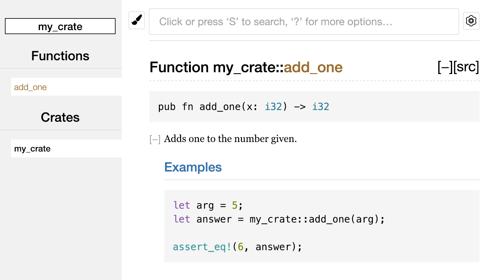

<style>
  @font-face {
    font-family: "Anka/Coder";
    src: url("/home/sasquatch/devel/fonts/ankacoder/AnkaCoder-r.ttf");
  }

  section {
    font-family: "Anka/Coder Regular";
  } 
  
  img { width: 100%; }

  h1 strong { color: #FF7500 !important; }
</style>

# **Rust One-Oh-One**

### ducks

May 15, 2020

---

## Preview

- Intro
- Installation
- Hello, World
- Common Programming Concepts (vars, types, functions, etc)
- Ownership

---

## What is, Rust?

A static, strongly typed and compiled language focusing on performance and
safety, especially concerning concurrency

---

## What is, Rust?

Started in 2006 by Graydon Hoare as a personal project. Sponsored by Mozilla
in 2009 and announced in 2010.

Rust 1.0 was released on **THIS DAY** in 2015.

---

## What is, Rust?

Fun fact: voted most loved programming language since 2016 in the SO Dev Suvery

---

## How to install Rust

Use `rustup` to install and manage Rust versions.

```
$ curl --proto '=https' --tlsv1.2 -sSf https://sh.rustup.rs | sh
```

---

## Rustup 

Update all branches:
`rustup update`

Update stable branch:
`rustup update stable`

Update rustup itself:
`rustup self update`

---

## Howdy, y'all 

```
fn main() {
    println!("Howdy, y'all");
}
```

---

## Ahoy, Cargo!

Cargo is Rust's build system and package manager. 

`cargo --version`

---

## Creating a new Cargo project
<!-- up_dog example -->

```
cargo new up_dog && cd up_dog
```


Cargo will create 2 files and 1 directory.


`Cargo.toml` - cargo project config file
`src/main.rs` - src directory with our main rust file

---

## Cargo config

```
[package]
name = "up_dog"
version = "0.1.0"
authors = ["Up Dog <up@dog.com>"]
edition = "2018"

[dependencies]
```

---

## Building and running

`cargo build`

`cargo run`

`cargo run -- --verbose --dry-run` 

---

### Test, Docs, Benchmarks, Check

`cargo test`

`cargo doc`

`cargo bench`

`cargo check`

---

## Common Programming Concepts

- variables
- data types
- functions
- flow control
- comments

---

## Variables and mutability
<!-- immutable-variables example -->

```
let pi = 3.14159;
```

By default, variables are immutable.
This is a Rust nudge towards safety and concurrency.

Rust uses conventional snake case for variable names as well as function names.

---

## Variables and mutability
<!-- mutable-variables example -->

Declare a mutable var by using the `mut` keyword.

```
let mut count = 0;
```

---

## Constants

Cannot use `mut` with constants.
Define with `const` and the value type must be annotated.

`const MAX_HP: u32 = 100_000;`

---

## Data types

Because Rust is *statically typed*, it must know the types of all vars at
compile time. Often, the compiler can infer the type based on the value.

However, in more complex situations, such as converting types, you will need
to provide an annotation.

---

## Scalar types

A scalar type represents a single value. Rust has four primary scalar types:
integers, floating-point numbers, Booleans, and characters.

---

## Integers

An int is a number without a fraction. They can be `u` for unsigned or `i` for
signed. 

We saw `u32` earlier.

This is a positive number that takes up 32 bits of space.

---

| Length  | Signed | Unsigned |
| ------- |:------:| --------:|
| 8-bit   | i8     | u8       |
| 16-bit  | i16    | u16      |
| 32-bit  | i32    | u32      |
| 64-bit  | i64    | u64      |
| 128-bit | i128   | u128     |
| arch    | isize  | usize    |

---

## Floating-point numbers

Rust has two primitive types for floating-point numbers, which are numbers with
decimal points.

Those two types are `f32` and `f64` which contain 32 bits and 64 bits
respectively.

```
let version = 2.0;

let y: f32 = 3.0;
```

---

## Numeric Operations

Rust supports the basic math operations you're used to: addition, subtraction,
multiplication, division, and remainder.

---

## Boolean

Two possible types: `true` or `false`.

```
let t = true;

let f: bool = false;
```

---

## Character Type

`char` is Rust's most primitive alphabetic type.
Note that `char` types are defined with single quotes instead of double quotes.

```
let z = 'z';

let poop = '💩';
```

---

## Character Type

Rust’s `char` type is four bytes in size and represents a Unicode Scalar Value,
which means it can represent a lot more than just ASCII. Accented letters;
Chinese, Japanese, and Korean characters; emoji; and zero-width spaces are all
valid char values in Rust.

---

## Compound Types

Compound types can group multiple values into a single type and Rust has two
of these types: tuples, and arrays.

---

## Tuples

Tuples are a general way to group any number of values with a variety of types.
Tuples have a fixed length and once declared, cannot grow or shrink.

```
let tup: (i32, f64, u8) = (350, 6.4, 1);

let (x, y, z) = tup;

let tree_fiddy = tup.0;
```

---

## Array

Unlike tuples, every element of an array must have the same type.
Rust arrays differ slightly because they have a fixed length.

```
let arr = [1, 2, 3, 4, 5];
```

---

## Array

Useful for when you want data allocated on the stack instead of the heap or
if you want to ensure you always have a fixed number of elements.

```
let months = [
    "January", "February", "March", 
    "April", "May", "June", "July",
    "August", "September", "October", 
    "November", "December"
];
```

---

## Array Access

Like other languages, you can access an array element by index.
Rust indices start at 0.

```
let arr = [1, 2, 3];
let first_el = arr[0];
```

---

## Functions

Functions are defined with `fn` and have a set of parens after the function
name. The curly brackets then tell the compiler where the function body
begins and ends. Order of functions does not matter.

---

## Function parameters

```
fn add(x: u32, y: u32) {
  println!("total: {}", x + y);
}
```

---

### Statements and Expressions

Function bodies are made up of a series of statements optionally ending in an
expression. Rust is an expression-based language so this distinction is
is important.

---

### Statements and Expressions

Statements are instructions that perform some action but do not return a value.
Expressions evaluate to a resulting value.

Creating a variable and assigning a value with `let` is a statement.

---

### Statements and Expressions

In fact, the whole example is a statement as function definitions are also
statements.
```
fn main() {
    let y = 6;
    println!("y: {}", y);
}
```

---

### Statements and Expressions

This differs from other languages such as C or Ruby where assignment returns
the value. In those languages, you can write `x = y = 6` and have both `x` and
`y` have the value of 6; this is not the case with Rust.

---

### Statements and Expressions

Here, `x+1` will evaluate to and return 6. 

```
fn main() {
    let x = 5;

    x + 1
}
```

---

### Statements and Expressions

Note the missing semicolon.

In Rust, expressions **DO NOT** include ending semicolons. A semicolon
turns it into a statement and it will not return a value.

---

### Return Values 

Functions can return values to the code that calls them. We do not name the
return values, but we do declare the type after an arrow (`->`).

In Rust, the return value is synonymous with the value of the final expression
in the function.

---

### Return Values

You can return early from a function by using `return` but most functions in
Rust return the last expression implicitly.

```
fn pi() -> f64 {
    3.14159
}
```

---

### Comments

``` 
// this is a comment
```

```
// a bit longer
// and a more complicated
// version of a comment
// I wish they had better mulitline support
```

---

### Comments

```
fn main() {
    let one = 1; // comment can go here
}

fn less_main() {
    // but you should probably do this
    let two = 2;
}
```

---

### Documentation Comments

```
/// Adds one to the number given.
///
/// # Examples
///
/// ```
/// let arg = 5;
/// let answer = my_crate::add_one(arg);
///
/// assert_eq!(6, answer);
/// ```
pub fn add_one(x: i32) -> i32 {
    x + 1
}
```

---

### Documentation Comments
```
cargo doc

cargo doc --open
```
---



---

### Documenting Contained Items

These doc comments are main used for documenting the lib or main module as a
whole.

```
//! # My Crate
//!
//! `my_crate` is a collection of utilities to make 
//!  performing certain calculations more convenient.

/// Adds one to the number given.
// --snip--
```

---


---

### Controlling Flow

- if, if else, else if, if in let
- loop, while, for

---

### If and Else

```
let number = 3;

if number < 5 {
  println!("condition was true");
} else {
  println!("condition was false");
}
```

---
If arm must evaluate to a `bool`

```
let number = 3;

if number {
  println!("number was three");
}
```

---
